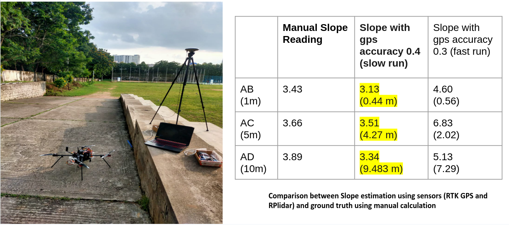
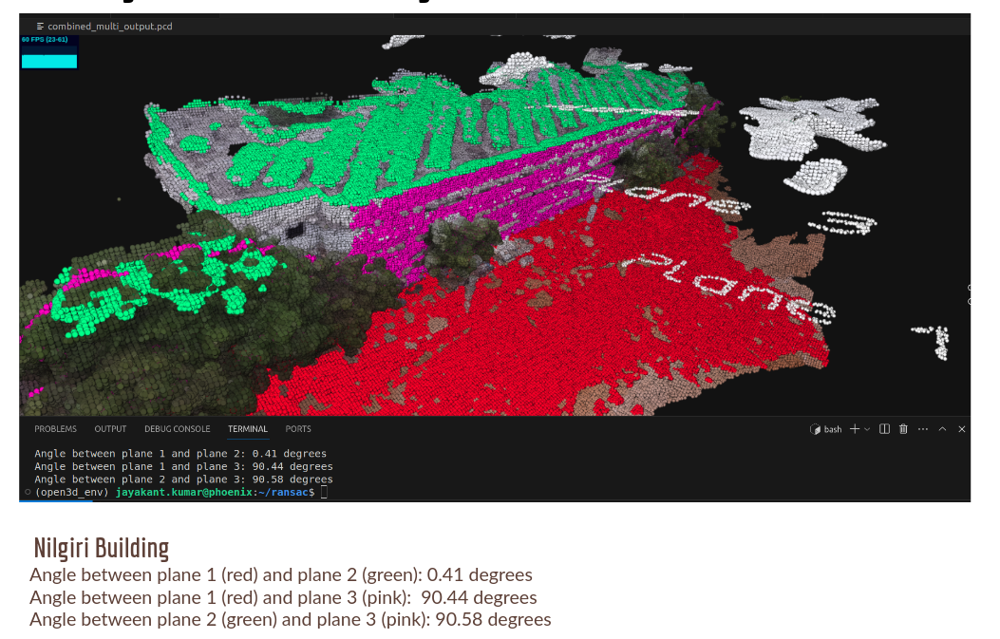
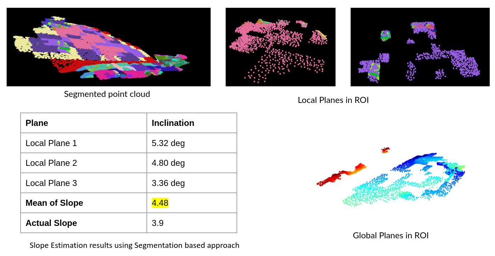

# Building Tilt Estimation 

## Approach 1 : Sensor Based Slope Estimation 


1. We are using 2d Lidar and RTK GPS for getting the slope data for setup and 

Instructions to run the code : 
1. Clone and build the px4 and rplidar ros packages from source

```
roscore
roslaunch mavros px4.launch (buid )
roslaunch rplidar_ros rplidar_a2m12.launch
cd main_code/slope_estimation/scripts/
python3 slope_estimation.py
```

2. Set the rosparam to record the specific reading at the slope

```
rosparam set /reading_trigger true
```

## Approach 2 : RANSAC based plane fitting and estimation




Instructions to run the code : 
1. Run the script 

```
python3 fit_plane.py
```

## Approach 3 : Clustering-Based Plane Segmentation Neural Network for Urban Scene Modeling




## Requirements
* Python 3.8
* Pytorch 1.7.1
* scikit-learn 0.24.2
* Open3d 0.13.0

## Dataset

We used Virtual KITTI Dataset from <a href="https://github.com/VisualComputingInstitute/vkitti3D-dataset" target="_blank">here</a>. 

We used voxel downsampling to filter the dataset and extract man-made structures such as roads and buildings.

Sample datasets are stored in the dataset folder

## Installation
```
git clone https://github.com/jimmy9704/plane-segmentation-network.git
cd plane-segmentation-network/
```


## Training
Run the following command to start training
```
python train.py 
```
Description of options
```
train(pointnet, dataset,train_loss, epochs=100,make_label=False, save=True)
make_labels(dataset,max_k=15,iteration=10)
```
You can create a label for training PointNet by setting the ```make_label``` option to 'True'.

You can change ```max_k``` and ```iteration```.

```max_k``` is the maximum number that PointNet will estimate

```iteration``` is the number of Hybrid-Kmeans iterations

```iteration``` can be reduced to reduce time consumption but it might cause unstable results.

## Test
Run the following command to start test
```
python test.py
```
Description of options
```
valid(pointnet, dataset, save_num=99,iteration=5)
```
```save_num``` is the check point to load for PointNet.


Pre-trained checkpoints can be loaded by setting 'save_num' to 99.

Results are saved as ```.txt``` files in ```./result```. Each file contains a ```N x 6``` matrix, where N is the number of points in a scene and 6 is the number of features per point. The features are XYZRGB. Each column is separated by ```;```.


