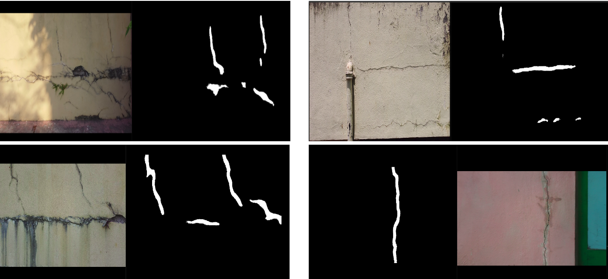

# Crack Detection Module 

We are segmenting the cracks using unsupervised domain adaptation approach. 




Instruction to run the code : 

1. To segment the given images : 
```
cd CrackIL 
python3 test_target.py
```

2. To get the accuracy with the given images and label : 
```
cd CrackIL 
python3 test_label.py
```

Note : To give the correct path of images folder and labels folder,
check the passed arguments in above python file
