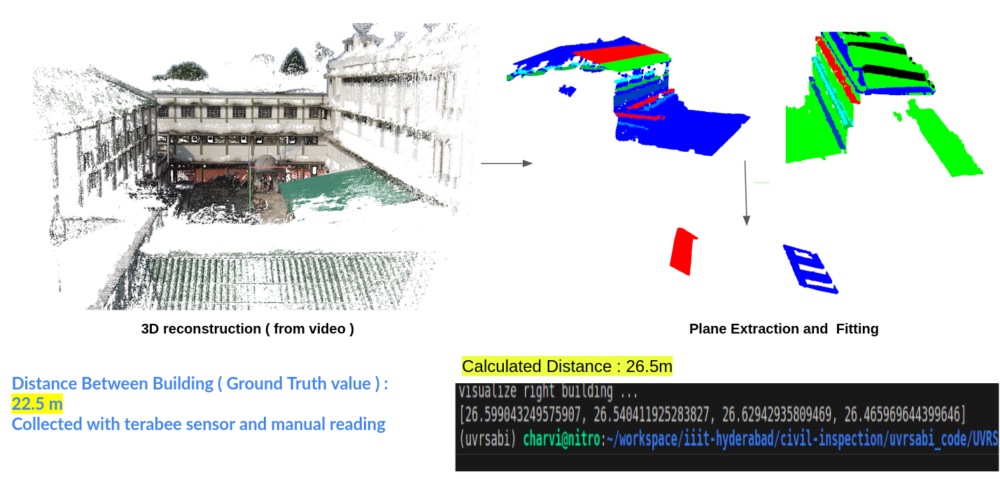

# Distance Between Building



Instructions to run the code : 


1. Get sampled images (check utils folders of this repo ), and pass correct video name and sampling rate. 


```
cd ../utils 
python3 vid2imag.py
```

2. 3D Reconstruction of the scene :

We are using the colmap tool to 3d reconstruction the scene. Follow the command line instructions in the below link to generate 
the ply file of 3d scene from images collected. 

Link : https://colmap.github.io/

3. There are 3 different modes to calculate the distance between the buildings, run the script as follows : 

( give the correct point cloud file path generated using colmap in the below python file )

```
cd DistanceModuleFrontalMode
python3 FrontalMode.py
```

Similarly, we could run the InbetweenMode.py and RoofMode.p from their respective folder. 