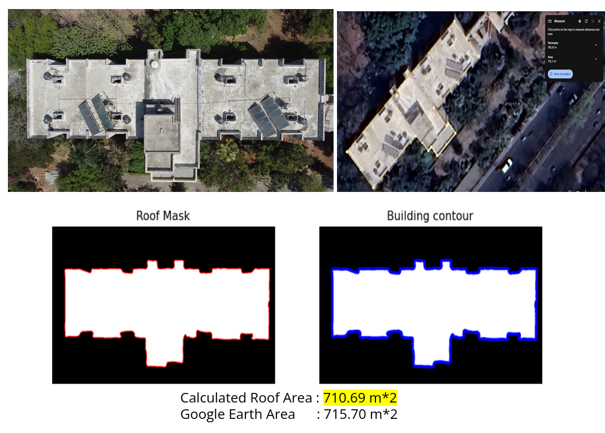
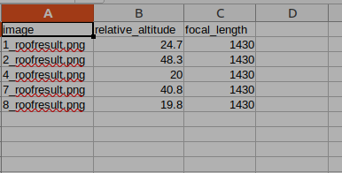

# Roof Area Estimation 

1. Estimating the roof masks of the image



```
cd LEDNet/test 
chmod 777 test.py   
mkdir ../images                         
mkdir ../roof_masks
python test.py --datadir ../images --resultdir ../roof_masks
```

2. Create the log file as given in folder log.csv, get info from the DJI drone camera data 



3. Estimate the Roof Area and config the log file name and other params in below python file

```
cd RoofAreaCalculation
python find_area.py --roofmasks RoofMasks --log_file $2 --save_dir_intermediate $results_path/intermediate_results --save_dir_final $results_path/final_results
```

4. Groud truth of the roof is calculated from Google earth.  