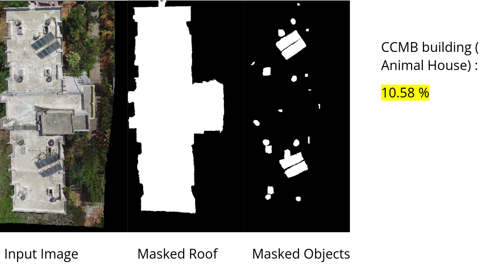

# Roof Layout Estimation

We are segmenting both the roof and objects to estimate the roof layout occupancy and stitiching afterwards. 




Instructions to run the code : 

1. Get sampled images (check utils folders of this repo ), and pass correct video name and sampling rate. 


```
cd ../utils 
python3 vid2imag.py
```


2. Estimating the roof masks 


```
cd LEDNet/test
chmod 777 test.py
mkdir ../images
mkdir ../roof_masks
python test.py --datadir ../images --resultdir ../roof_masks

```

3. Getting the roof masks 

```
cd Detic
python demo.py --config-file detic/configs/Detic_LCOCOI21k_CLIP_SwinB_896b32_4x_ft4x_max-size.yaml --input ../images/*.jpg --output ../object_masks --vocabulary custom --custom_vocabulary solar_array,air_conditioner,vent,box,sink --confidence-threshold 0.5 --opts MODEL.WEIGHTS Detic_LCOCOI21k_CLIP_SwinB_896b32_4x_ft4x_max-size.pth
```

4. Stitch the masks and input 

```
cd ..
python stitch.py -i images -o ObjectMasks -r RoofMasks -s $results_path/stitching_results
```

5. Calculating the occupancy 

```
chmod 777 calculateoccupancy.py
python calculateoccupancy.py -r ../RoofLayoutEstimationResults/stitching_results/stitched_roof_mask.jpg -o ../RoofLayoutEstimationResults/stitching_results/stitched_object_mask.jpg -t ../RoofLayoutEstimationResults/final_results/final_results_roof_layout_estimation.txt
```

Note : Above are the steps wise instructions that could be run all at once from the given bash script too (RoofLayoutEstimaation.sh)