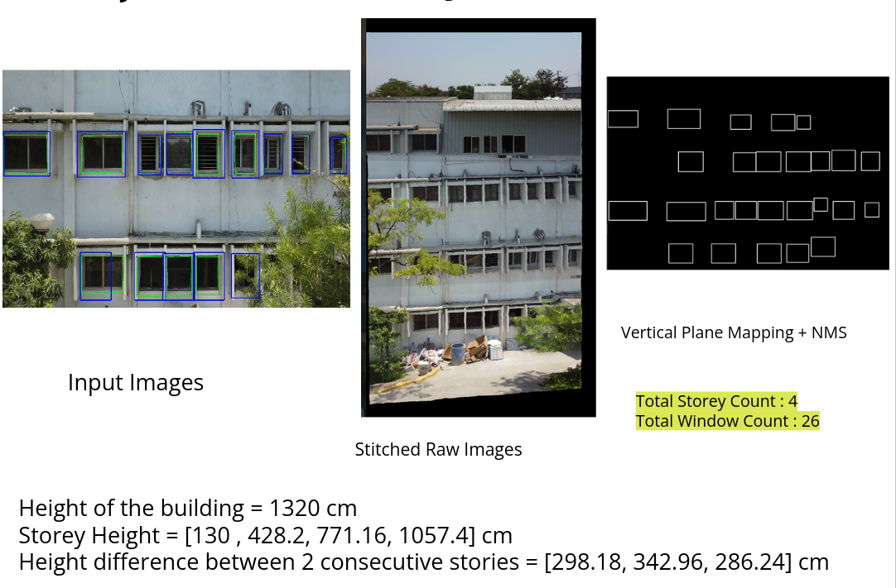

# Window Count and Storey Height Estimation 



Instructions to run the code : 

1. Traverse to the wind_det_heatmaps and also download the weights of the model provided link in codebase Readme

2. Run the inference script
```
python infer.py --cfg /path/to/yaml/config \
        --model /path/to/model \
        --infer /path/to/image/directory
```

This generates 2 dirs: infer_result and post_process_result and need to prepare respective log file as provided in codebase

3. Configure the parameters in below file and to run using below command to perform NMS and get the storey count from the images folder

```
cd mapToVerticalPlane
python main.py
```


